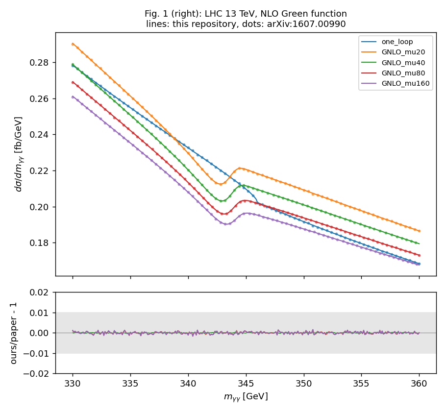

# pyTMDP

**T**op-quark **M**ass from the **D**i**P**hoton mass spectrum.

Pseudo-experiment study of how well the top-quark mass $m_t$ (and width $\Gamma_t$) can be
determined from the shape of the diphoton invariant-mass spectrum $m_{\gamma\gamma}$ near the
top-pair threshold $m_{\gamma\gamma}\simeq 2m_t$ at hadron colliders.

In $gg\to\gamma\gamma$ the top quark enters only through the one-loop box. Its absorptive part opens
at $m_{\gamma\gamma}=2m_t$ and produces a dip–bump structure in $d\sigma/dm_{\gamma\gamma}$. Near
threshold, the amplitude is matched to the NRQCD Green function of the $t\bar t$ system,
$\mathcal{M}^{\rm 1loop}+\mathcal{B}\,[G(E+i\Gamma_t)-G_0(E)]$, which resums the Coulomb (bound-state)
effects. The location and shape of the structure depend on $m_t$ and $\Gamma_t$.

- S. Kawabata and H. Yokoya, *Top-quark mass from the diphoton mass spectrum*,
  [arXiv:1607.00990](https://arxiv.org/abs/1607.00990), Eur. Phys. J. C 77 (2017) 323. This is the
  LO + Green-function calculation that `fortran/gg2aa` implements.
- L. Chen, G. Heinrich, S. Jahn, S. P. Jones, M. Kerner, J. Schlenk and H. Yokoya,
  *Photon pair production in gluon fusion: Top quark effects at NLO with threshold matching*,
  [arXiv:1911.09314](https://arxiv.org/abs/1911.09314), JHEP 04 (2020) 115. This is the NLO
  follow-up and is not implemented here.

> **Status (2026-10).**
>
> - The **signal of arXiv:1607.00990 is reproduced**: all curves of its Figs. 1 and 4 agree with
>   this repository to within 1% (see [Reproducing arXiv:1607.00990](#reproducing-arxiv160700990)).
> - The 2018 Python code runs with Python 3.12 / ROOT 6.34 in the Docker image, but has known
>   problems that are documented and not yet fixed (see [docs/REVIEW.md](docs/REVIEW.md)). The most
>   important one is **P1**: with current ROOT, `TH1::FillRandom` silently produces *empty*
>   pseudo-data in `TMDP.genEvents`, so fits run on empty histograms.
> - The legacy Fortran integrands return an undefined value outside the cuts (**P3**). Depending
>   on the compiler optimisation, $d\sigma/dm_{\gamma\gamma}$ changes by a factor of about 2.
>   `fortran/src/mktemplate.f` is fixed, and the paper's figures are not affected.

## How it works

1. **Templates (signal).** For each $(m_t,\Gamma_t)$, `fortran/build/mktemplate.exe` computes
   $d\sigma(pp\to gg\to\gamma\gamma)/dm_{\gamma\gamma}$ [fb/GeV] for 300–400 GeV in 0.1 GeV steps.
   It includes the light-quark and top loops and the Green-function matching, and writes
   `Tab_<mt>_<Gt>.dat`.
2. **Backgrounds.** These are $m_{\gamma\gamma}$ event lists for direct, one-fragmentation and
   two-fragmentation photon pairs (`Direct.dat`, `OneF.dat`, `TwoF.dat`). They are **not** in this
   repository; see [Background data](#background-data).
3. **Pseudo-experiments** (`TMDP.py`). Events are generated from the background and from the
   signal template at the true mass, and binned in `hbin` bins over 300–400 GeV.
   - Each pseudo-dataset is fitted in `[fmin, fmax]` with
     $(1-k_{gg})\,f_{\rm ATLAS}(m;a)+k_{gg}\,f_{\rm template}(m;m_t)$, where
     $f_{\rm ATLAS}\propto(1-(m/\sqrt s)^{1/3})^a$, once for every template.
   - The template with the smallest $\chi^2$ gives the best-fit $m_t$.
   - `ScanMass.py` repeats this `Nloop` times and reports the mean and spread.

## Repository layout

| Path | Content |
|---|---|
| `TMDP.py` | Classes `TMDP` (inputs, pseudo-data, fit functions) and `GG2AA` (one template) |
| `ScanMass.py`, `ScanWidth.py`, `Scan2D.py` | Scans in $m_t$, in $\Gamma_t$, and in $(m_t,\Gamma_t)$ |
| `yaml/fit/` | Fit inputs (2018): LHC 13 TeV, HE-LHC 27 TeV and FCC 100 TeV; mass, width and 2D scans |
| `yaml/templates/` | Template-set configs: one per 2018 template directory, the paper's setup (`paper1607_*`), and a quick test set |
| `yaml/repro/1607.00990.yml` | Setup and curves for reproducing the paper's figures |
| `reference/1607.00990/` | Curves extracted from the paper's vector figures (CSV) |
| `fortran/gg2aa/` | 2016 Fortran of arXiv:1607.00990 (amplitudes, Green functions, drivers). Unchanged except that the order of the Green-function potential in `gg2aaG.f` can be set (default NLO, as before) |
| `fortran/QCD/` | libQCD: running $\alpha_s$ (QCD-PEGASUS), unchanged |
| `fortran/src/mktemplate.f` | Template generator, one $(m_t,\Gamma_t)$ per run, parameters via namelist |
| `fortran/stubs/` | No-op BASES routines (BASES is not needed for the VEGAS-based programs) |
| `fortran/Makefile` | Linux build (the original macOS makefiles are kept as `*/Makefile.legacy`) |
| `scripts/make_templates.py` | Runs `mktemplate.exe` over a $(m_t,\Gamma_t)$ grid in parallel |
| `scripts/reproduce_1607_00990.py` | Computes all curves of Figs. 1 and 4 of the paper and compares them with `reference/` |
| `scripts/tools/digitize_1607_00990.py` | Extracts the curves from the figure PDFs of the arXiv source |
| `docker/Dockerfile` | Toolchain image: ROOT 6.34, gfortran, LHAPDF 6.5.5 + CT14 sets, CHAPLIN 1.2 |
| `tests/` | End-to-end smoke test (Fortran → templates → fit), yaml consistency, spot checks against the paper |
| `docs/REVIEW.md` | Code review (2026-10) and proposed fixes |
| `THIRD_PARTY.md` | Third-party Fortran shipped in `fortran/` |

## Quick start (Docker)

Everything runs in a container, with the repository mounted at `/work`.

```bash
docker build -t pytmdp:dev docker                    # once
docker run --rm -v "$PWD:/work" pytmdp:dev make -C fortran
docker run --rm -v "$PWD:/work" pytmdp:dev python3 -m pytest -q tests
```

On Windows Git Bash, prefix the commands with `MSYS_NO_PATHCONV=1` and use an absolute path such as
`-v "D:/Physics/pyTMDP:/work"`. For an interactive shell, use
`docker run --rm -it -v "$PWD:/work" pytmdp:dev`.

## Inputs: `yaml/`

All inputs are YAML files under `yaml/`. Each fit input reads its templates and backgrounds from a
directory `dir`. Each such directory is one template set, made by one config in
`yaml/templates/`:

| Template set (`Template/…`) | $\sqrt s$ | $p_T$ cut | Fit inputs (`yaml/fit/`) | Templates |
|---|---|---|---|---|
| `LHC13T` | 13 TeV | tight | `input_LHC13T.yml`, `inputWidth_LHC13T.yml` | 50 |
| `LHC13L` | 13 TeV | loose | `input_LHC13L.yml` | 33 |
| `HELHC27T` | 27 TeV | tight | `input_HELHC27T.yml`, `input2D_HELHC27T.yml` | 185 |
| `FCC100` | 100 TeV | tight | `input_FCC100.yml`, `inputWidth_FCC100.yml`, `input2D_FCC100.yml` | 379 |
| `test` | 13 TeV | tight | — (used by `tests/`) | 2 |

- *tight* means $p_T>0.4\,m_{\gamma\gamma}$ in addition to $p_T>40$ GeV and $|\eta|<2.5$; *loose*
  drops the relative cut.
- The meaning of `T`/`L` in the set names is inferred from the "Tight PTCUT" comments in
  `fortran/gg2aa`. It is not documented in the 2018 files.
- A template config lists its fit inputs under `fit_inputs`. The templates to compute are
  collected from their `files_sig` and `files_template`, so the two sides cannot drift apart.
- `tests/test_yaml.py` checks that every fit input belongs to exactly one template config, with the
  same directory and $\sqrt s$, and that all its templates are covered.

### Generate templates

```bash
docker run --rm -v "$PWD:/work" pytmdp:dev \
    python3 scripts/make_templates.py yaml/templates/LHC13T.yml -j 16
```

`--check` lists the templates of a set and checks the config without running anything.

- Templates are written to the `outdir` of the config (for example `Template/LHC13T/`), together
  with a `manifest.json` that records the configuration and the git commit.
- Existing files are skipped unless you pass `--force`.
- One production template (1001 points, VEGAS 50 000 calls × 6 iterations) is estimated to take about 80 min on
  one core (scaled from a timed low-statistics run). For example, `LHC13T` (50 templates) takes
  about 3.5 h on 20 cores, and `FCC100` (379 templates) about 25 h.

Template-config keys (`outdir` is required, plus `fit_inputs` and/or `masses` × `widths`; the
defaults are those of `MKD_gg2aa.f`):

| Key | Meaning | Default |
|---|---|---|
| `rs` | $\sqrt s$ [GeV] | 100000 |
| `pdfset` | LHAPDF set (must be installed in the image) | `CT14lo` |
| `outdir` | output directory; must equal the `dir` of every fit input | — |
| `fit_inputs` | fit inputs whose `files_sig` + `files_template` are computed | — |
| `masses`, `widths` | additional grid: list, or `{start, stop, step}` [GeV] | — |
| `mu_green` | scale of $\alpha_s$ in the Green function [GeV] | 40 |
| `etamax`, `ptmin` | photon $\lvert\eta\rvert$ and $p_T$ cuts | 2.5, 40 |
| `ptratio` | relative cut $p_T>{\rm ptratio}\cdot m_{\gamma\gamma}$; 0 = loose | 0.4 |
| `maa_min`, `maa_max`, `maa_step` | $m_{\gamma\gamma}$ grid [GeV]. `TMDP.py` requires 300, 400, 0.1 | 300, 400, 0.1 |
| `ncall`, `itmx` | VEGAS calls per point and iterations | 50000, 6 |

The physics settings are those of `MKD_gg2aa.f`: CT14lo, $\alpha=1/128$, $\mu_R=\mu_F=m_{\gamma\gamma}$,
LO running of $\alpha_s$, and an NLO Coulomb potential in the Green function.

### Run a mass scan

Put the background files in the template directory, then run:

```bash
docker run --rm -v "$PWD:/work" pytmdp:dev python3 ScanMass.py yaml/fit/input_LHC13T.yml 1000
```

`ScanWidth.py` and `Scan2D.py` take `yaml/fit/inputWidth_*.yml` and `yaml/fit/input2D_*.yml`. Paths
in the fit inputs (`dir`) are relative to the repository root, so run the scans from there.

Fit-input keys (`yaml/fit/*.yml`, as read by `TMDP.set_init`):

| Key | Meaning |
|---|---|
| `dir` | directory with templates and background files |
| `rs`, `lum`, `corr` | $\sqrt s$ [GeV], luminosity [fb⁻¹], overall correction factor |
| `kgg` | $gg\to\gamma\gamma$ (signal) fraction of all events |
| `sig_dir`, `sig_one`, `sig_two` | background cross sections in 300–400 GeV [pb] |
| `Nevnt` | total number of events; if omitted, $\sigma_{\rm bg}\cdot L\cdot 10^3\cdot{\rm corr}/(1-k_{gg})$ |
| `hbin`, `fmin`, `fmax`, `fitopt` | histogram bins in 300–400 GeV, fit range [GeV], ROOT fit options |
| `files_dir`, `files_one`, `files_two` | background event files |
| `files_sig` | template used to generate the pseudo-data (true mass) |
| `files_template` | templates fitted to each pseudo-dataset |

The units of `sig_*` are inferred from the `Nevnt` formula and have not been checked against the
original setup.

## Reproducing arXiv:1607.00990

```bash
docker run --rm -v "$PWD:/work" pytmdp:dev make -C fortran
docker run --rm -v "$PWD:/work" pytmdp:dev \
    python3 scripts/reproduce_1607_00990.py yaml/repro/1607.00990.yml -j 20
```

This computes every curve of Figs. 1 and 4 of the paper with the paper's setup:
19 curves, about 6000 $m_{\gamma\gamma}$ points, roughly 30 min on 20 cores.

- **Outputs.** In `results/1607.00990/`:
  - one `.dat` file per curve
  - plots of our curves over the paper's (`fig1L.png`, `fig1R.png`, `fig4L.png`, `fig4R.png`)
  - `summary.md`
- **Comparison.** Each curve is compared with the same curve extracted from the paper's vector
  figures (`reference/1607.00990/`, made by `scripts/tools/digitize_1607_00990.py` from the
  arXiv source). The script exits with status 0 when every curve agrees within the tolerance
  (1%).
- **Spot checks.** `tests/test_repro_1607_00990.py` checks six points (dip, bump, LO Green
  function, FCC) to within 0.5% in about 30 s.

Setup (`yaml/repro/1607.00990.yml`):

- **From the paper.** CT14NLO; $\mu_R=\mu_F=m_{\gamma\gamma}$; $|\eta_\gamma|<2.5$.
  - Photon cut: $p_T^\gamma>40$ GeV at the LHC, and additionally $p_T^\gamma>0.4\,m_{\gamma\gamma}$
    at the FCC.
  - Top quark: $m_t=173$ GeV, $\Gamma_t=1.498$ GeV.
  - Green function: NLO (Fig. 1 left: LO), with $\mu=40$ GeV (Fig. 1: 20–160 GeV).
- **Not in the paper, but needed to match it.** $\alpha_s$ is run at LO from
  $\alpha_s(M_Z)=0.1185$ (libQCD `NQCD=0`, as in `MKD_gg2aa.f`). With NLO running the cross
  section is 1.4% lower everywhere.

**Result (2026-10-08): all 19 curves agree with the paper.** The largest deviation is 0.31%,
and the mean deviation of every curve is below 0.02%. The dip and bump positions agree to within
one grid step (0.1 GeV for Fig. 1, 0.25 GeV for Fig. 4). The full table and the plots are in
[docs/repro-1607.00990/](docs/repro-1607.00990/summary.md).

| Figure | Curves | Max. abs. deviation |
|---|---|---|
| Fig. 1 right (LHC, $G_{\rm NLO}$, $\mu$ = 20–160 GeV, one-loop) | 5 | 0.17% |
| Fig. 1 left (LHC, $G_{\rm LO}$, $\mu$ = 20–160 GeV, one-loop) | 5 | 0.21% |
| Fig. 4 left (LHC, $m_t$ = 167–179 GeV) | 5 | 0.12% |
| Fig. 4 right (FCC, $p_T>0.4\,m_{\gamma\gamma}$, $m_t$ = 167–179 GeV) | 5 | 0.31% |



To make pyTMDP templates with this setup, use `yaml/templates/paper1607_LHC13.yml` and
`paper1607_FCC100.yml` with `scripts/make_templates.py`. The background samples are inputs and are
not produced here.

## Background data

`TMDP.read_events_from_file` expects plain text with one $m_{\gamma\gamma}$ value [GeV] per event,
separated by whitespace, in 300–400 GeV. The 2018 files are not available, and the generator used
to make them (for example DIPHOX) has not been confirmed. Producing them is outside the scope of the
current milestone.

## Known issues and plans

See [docs/REVIEW.md](docs/REVIEW.md) for the full list and proposed fixes. Fixes are made after
review, in separate issues and PRs. Progress is tracked in issue #7.

## Third-party code

`fortran/` ships HPLOG, DDILOG, QCD-PEGASUS, a VEGAS variant and the CHAPLIN interface header,
unchanged. See [THIRD_PARTY.md](THIRD_PARTY.md). Their licences have not been checked yet.

## Author

Hiroshi Yokoya
